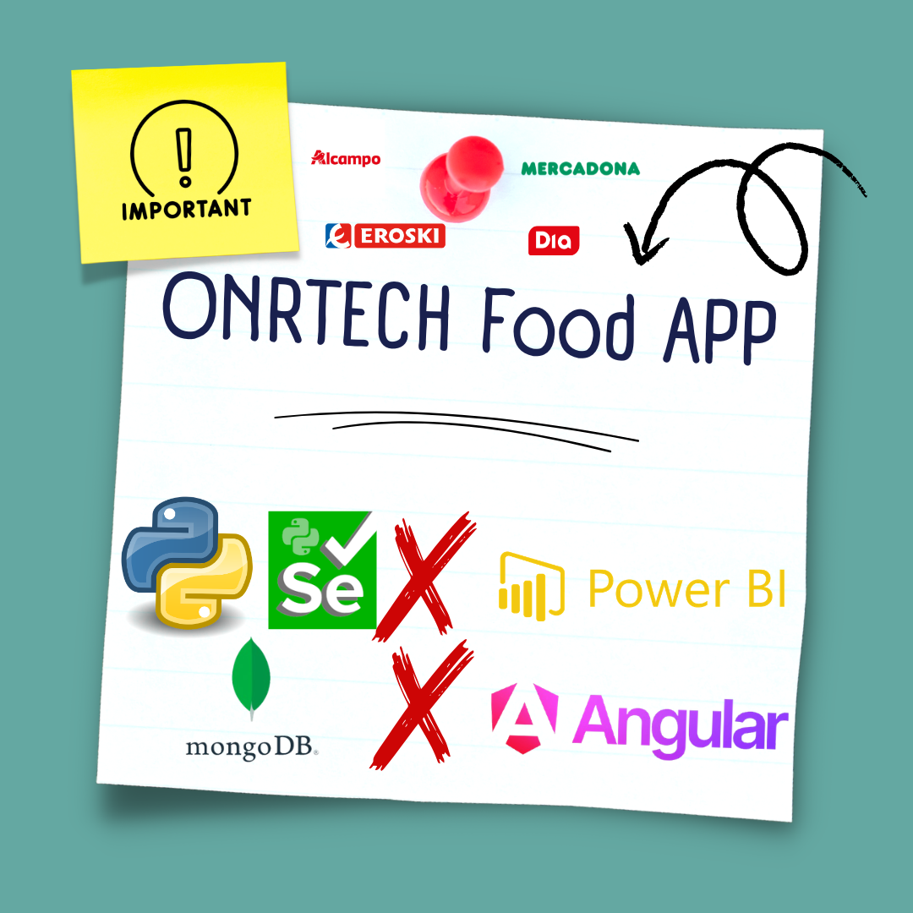
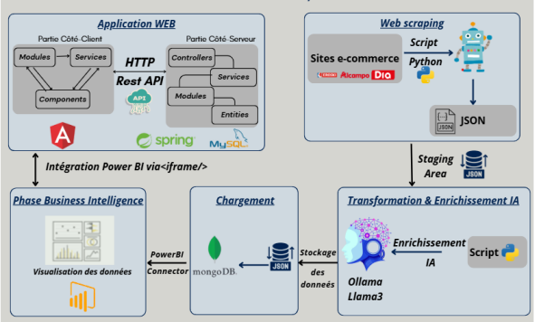

# 🍽️ ONRTECH Food Analytics



[](https://www.python.org/)
[](https://www.mongodb.com/)
[](https://powerbi.microsoft.com/)
[](https://ollama.com/)
[](LICENSE)

---

## 📋 Table des Matières

- [Aperçu](#-aperçu)
- [Objectifs](#-objectifs)
- [Structure du Projet](#-structure-du-projet)
- [Technologies](#-technologies)
- [Fonctionnalités](#-fonctionnalités)
- [Pipeline ETL](#-pipeline-etl)
- [Architecture](#-architecture)
- [Prérequis](#-prérequis)
- [Démonstration](#-démonstration)

---

## 📌 Aperçu

ONRTECH Food Analytics est un projet ETL (Extract, Transform, Load) conçu pour collecter, traiter et analyser des données alimentaires provenant de différentes sources en ligne. L'objectif principal est de construire une pipeline de données robuste permettant de transformer des données brutes issues du web scraping en informations exploitables pour l'analyse décisionnelle.

Ce projet intègre également des techniques modernes telles que l'enrichissement des données via des modèles de langage (LLM) et leur visualisation à travers des outils BI comme Power BI.
Le projet intègre également des modèles **LLM (Large Language Models)** pour améliorer la qualité des données et fournir une analyse intelligente.

---

## 🎯 Objectifs

- Automatiser la collecte de données produits (web scraping)
- Nettoyer et structurer des données massives (plusieurs GB)
- Enrichir les données avec l’intelligence artificielle
- Stocker les données dans une base NoSQL scalable (MongoDB)
- Fournir des visualisations interactives avec Power BI
- Développer une interface web pour explorer les données

---

## 🏗 Structure du Projet

- **scraping/** : Scripts de web scraping (collecte des données)
- **etl/** : Pipeline ETL (nettoyage, transformation, enrichissement)
- **data/** : Fichiers JSON bruts et transformés
- - **powerbi/** : Rapports et dashboards Power BI
- **web-app/** : Interface utilisateur (frontend + backend)

---

## 🛠 Technologies

- **Python** : Web scraping & traitement des données
- **MongoDB Atlas** : Base de données NoSQL
- **Power BI** : Visualisation et dashboards
- **Ollama  (LLM)** : Enrichissement intelligent
- **SpringBoot / Angular** : Interface web

---

## 📊 Fonctionnalités

1. **Extraction des données**
   - Scraping de sites e-commerce
   - Génération de fichiers JSON volumineux

2. **Transformation des données**
   - Nettoyage (nulls, doublons)
   - Normalisation (prix, catégories)

3. **Enrichissement via LLM**
   - Classification automatique
   - Génération de descriptions
   - Correction sémantique

4. **Stockage MongoDB**
   - Insertion en collections structurées
   - Gestion de gros volumes de données

5. **Visualisation**
   - Dashboards Power BI interactifs

6. **Interface Web**
   - Recherche de produits
   - Filtrage dynamique
   - Consultation des données

---

## 🔄 Pipeline ETL

### 1️⃣ Extraction des données
- Scraping via Python (BeautifulSoup / Selenium)
- Collecte : nom, prix, catégorie, description, etc.
- Output : fichiers JSON

### 2️⃣ Transformation et normalisation
- Nettoyage des données
- Uniformisation des formats
- Structuration des champs

### 3️⃣ Enrichissement via LLM
- Classification intelligente
- Génération de contenu enrichi
- Normalisation des catégories

### 4️⃣ Chargement dans MongoDB
- Connexion MongoDB Atlas
- Insertion des documents JSON

### 5️⃣ Exploitation
- Power BI
- Interface Web

---

## 🏗 Architecture

<p align="center">
  
</p>

---

## ⚙ Prérequis

- Python 3.10+
- MongoDB Atlas account
- Power BI Desktop
- Node.js (si interface web)
- pip / virtualenv

---

## 🚀 Installation

```bash
# Clone repository
git clone https://github.com/your-username/onrtech-food-analytics.git

# Go to project
cd onrtech-food-analytics

# Install dependencies
pip install -r requirements.txt
